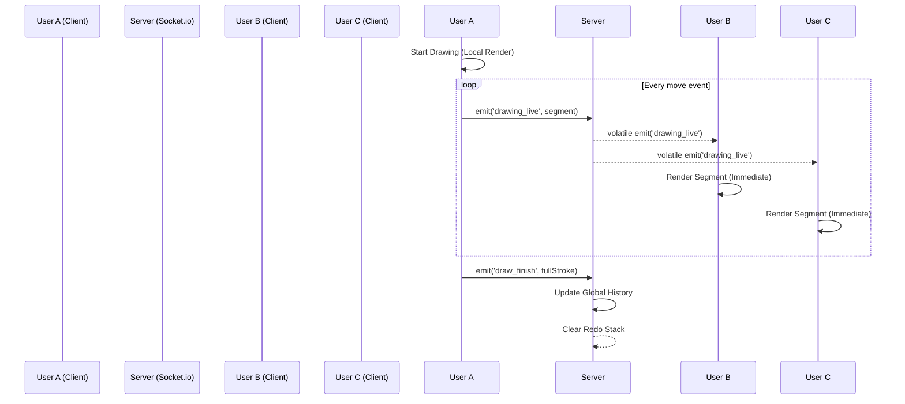

# Architecture Documentation - Collaborative Canvas

This document outlines the technical architecture, data flow, and design decisions of the Real-Time Collaborative Canvas.

## Project Structure

```text
├── client/          # React Frontend
│   ├── src/
│   │   ├── components/
│   │   │   ├── Canvas/   # Core drawing logic & Canvas API
│   │   │   └── Toolbar/  # UI Controls
│   │   └── socket.js     # Socket.io client configuration
├── server/          # Node.js/Socket.io Backend
│   ├── server.js        # Entry point & event handlers
│   ├── rooms.js         # Room management logic
│   └── state-manager.js # History and undo/redo handling
└── ARCHITECTURE.md      # This document
```

## Data Flow Diagram

The following diagram illustrates how drawing data moves from a source user to all other participants in a room.



## WebSocket Protocol

The application uses Socket.io for bidirectional, low-latency communication.

### Key Events

| Event           | Type | Payload                 | Description                                               |
| :-------------- | :--- | :---------------------- | :-------------------------------------------------------- |
| `join_room`     | Send | `{ roomId, user }`      | Authenticates and joins a specific room.                  |
| `init_state`    | Recv | `{ history, users }`    | Syncs the existing canvas state upon joining.             |
| `drawing_live`  | Both | `{ start, end, style }` | Real-time transmission of incremental line segments.      |
| `draw_finish`   | Send | `{ roomId, data }`      | Signals the completion of a stroke for history recording. |
| `cursor_move`   | Send | `{ roomId, x, y }`      | Updates the server on the user's cursor position.         |
| `undo` / `redo` | Both | `{ roomId }`            | Triggers a global undo/redo action.                       |

## Undo / Redo Strategy

The application implements a **Global Undo/Redo** system managed by the `StateManager` on the server.

1. **Stacks**: The server maintains a `globalHistory` stack (all completed strokes) and a `redoStack` (all undone strokes).
2. **Undo Action**: When an `undo` event is received, the server pops the top action from `globalHistory`, pushes it to `redoStack`, and broadcasts a refresh command to all clients.
3. **Redo Action**: When a `redo` event is received, the server pops from `redoStack` back to `globalHistory`.
4. **Invalidation**: Any new drawing action (`draw_finish`) clears the `redoStack` to maintain consistency.

## Performance Decisions

- **Volatile Broadcasts**: Live drawing segments and cursor movements are broadcast as `volatile`. This means if a user has a temporary connection glitch, these transient updates are dropped rather than queued, preventing "lag spikes" or "catch-up bursts" that would degrade the real-time experience.
- **Dual Layer Canvas**: The frontend uses two `<canvas>` elements overlapping.
  1. **Background Layer**: Contains the actual drawing. This is only redrawn when necessary (e.g., global undo/redo).
  2. **UI Layer**: Contains cursors and temporary UI elements. This layer is cleared and redrawn every animation frame (`requestAnimationFrame`) to ensure smooth cursor movement without affecting the drawing data.
- **Incremental Updates**: Instead of sending the entire canvas state every frame, only small line segments are transmitted during an active stroke.

## Conflict Handling

- **Simultaneous Drawing**: Since each stroke is uniquely identified and rendered incrementally, multiple users can draw at the same time without overwriting each other's work.
- **Race Conditions**: The server acts as the single source of truth. If two users click "Undo" nearly simultaneously, the server processes them sequentially, resulting in the two most recent actions being undone in the order they were processed.
- **State Synchronization**: When a user joins, they receive the full `globalHistory`. If any client goes out of sync (e.g., during an undo), the server sends the full history response to ensure all clients converge on the same visual state.
