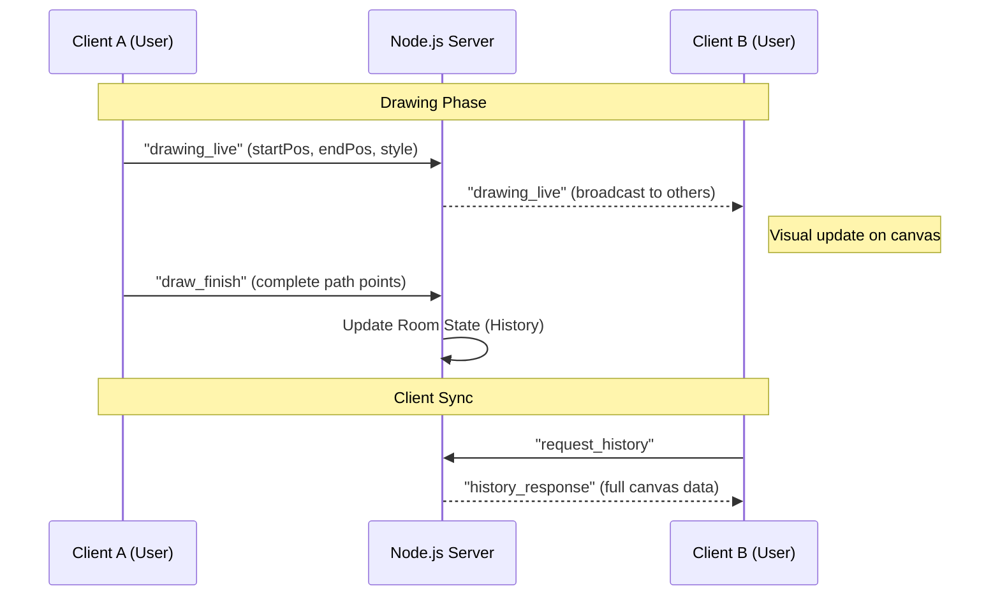

# Project Architecture

This document outlines the technical design, data flow, and key engineering decisions made for the Collaborative Canvas.

## Data Flow Diagram

The application follows a star topology where the server acts as the central hub for state synchronization.

1. **Input**: User interacts with the HTML5 Canvas via Mouse/Touch events.
2. **Transient Update**: Local segments are drawn immediately and emitted via `drawing_live` for zero-latency feedback to other users.
3. **Persistence**: On `mouseUp`, the full stroke (array of points) is sent to the server to be added to the room's global history.

---

## WebSocket Protocol

Communication is handled via **Socket.io**.

### Events Sent (Client -> Server)

| Event           | Payload                         | Description                                   |
| :-------------- | :------------------------------ | :-------------------------------------------- |
| `join_room`     | `{ roomId, user }`              | Joins a collaboration room.                   |
| `drawing_live`  | `{ roomId, start, end, style }` | Volatile real-time line segment updates.      |
| `draw_finish`   | `{ roomId, data }`              | Sends the final completed stroke to be saved. |
| `cursor_move`   | `{ roomId, x, y }`              | Updates user cursor position.                 |
| `undo` / `redo` | `{ roomId }`                    | Triggers global undo/redo logic.              |

### Events Received (Server -> Client)

| Event           | Payload                 | Description                                  |
| :-------------- | :---------------------- | :------------------------------------------- |
| `init_state`    | `{ history, users }`    | Initial synchronization on joining.          |
| `drawing_live`  | `{ start, end, style }` | Renders another user's line segment.         |
| `cursor_update` | `{ userId, x, y }`      | Moves another user's cursor on the UI layer. |
| `undo` / `redo` | `{ actionId }`          | Commands client to refresh history.          |

---

## Undo / Redo Strategy

The system uses a **Global Command Pattern** managed on the server.

- **Global History**: The server maintains a stack of actions (`globalHistory`) for each room.
- **Redo Stack**: When an action is undone, it's moved from `globalHistory` to a `redoStack`.
- **Synchronization**: When an undo/redo occurs, the server emits an event. Clients then request the updated history (or the server pushes it) to ensure all users see the exact same state.

---

## Performance Decisions

1. **Volatile Broadcasting**: Live drawing segments and cursor movements are sent using `socket.volatile`. This ensures that if a network packet is dropped, it isn't re-sent, preventing "lag spikes" or "rubber-banding" during fast drawing.
2. **Layered Canvases**:
   - **BG Canvas**: Handles the actual persistent painting.
   - **UI Canvas**: Handles high-frequency updates like other users' cursors and names using `requestAnimationFrame`. This prevents redrawing the entire drawing history 60 times a second.
3. **Point Throttling**: Only relevant movement segments are captured to prevent flooding the server with thousands of redundant identical data points.

---

## Conflict Handling

- **Atomic History**: Because the server processes events sequentially (Node.js single-threaded event loop), actions are naturally ordered. Each action is assigned a unique `UUID`.
- **Non-destructive Overlays**: Drawing is additive. Simultaneous users drawing in the same spot simply results in overlapping lines, modeled after real-world whiteboards.
- **State Reconciliation**: If a client goes out of sync, they can emit `request_history` at any time to pull the latest "Ground Truth" from the server.
